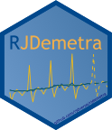

<!-- README.md is generated from README.Rmd. Please edit that file -->

```{r, echo = FALSE, include=FALSE}
knitr::opts_chunk$set(
  collapse = TRUE,
  comment = "#>",
  fig.path = "man/figures/README-",
  fig.align="center"
)
library(RJDemetra)
options(enable_print_style = FALSE)
```

# RJDemetra 

[](https://github.com/rjdverse/rjdemetra/actions)
[](https://cran.r-project.org/package=RJDemetra)
[](https://cran.r-project.org/package=RJDemetra)
[](https://cran.r-project.org/package=RJDemetra)
[](https://cran.r-project.org/package=RJDemetra)
[](https://github.com/SNStatComp/awesome-official-statistics-software)

RJDemetra is an R interface to JDemetra+, the seasonal adjustment software [officially recommended](https://wayback.archive-it.org/12090/20240102173448/https://cros-legacy.ec.europa.eu/system/files/Jdemetra_%20release.pdf) to the members of the European Statistical System (ESS) and the European System of Central Banks. JDemetra+ implements the two leading seasonal adjustment methods [TRAMO/SEATS+](https://gretl.sourceforge.net/tramo/tramo-seats.html) and [X-12ARIMA/X-13ARIMA-SEATS](https://www.census.gov/data/software/x13as.html).

Besides seasonal adjustment, JDemetra+ bundles other time series models that are useful in the production or analysis of economic statistics, including for instance outlier detection, nowcasting, temporal disaggregation or benchmarking.

For more details on the JDemetra+ software see <https://github.com/jdemetra/jdemetra-app>.

RJDemetra offers full access to all options and outputs of JDemetra+.

## Installation

RJDemetra relies on the [rJava](https://CRAN.R-project.org/package=rJava) package and Java SE version 8 or higher is required.


```{r, eval = FALSE}
# Install release version from CRAN
install.packages("RJDemetra")

# Install development version from GitHub
# install.packages("devtools")
devtools::install_github("rjdverse/rjdemetra")
```

If you have troubles with the installation, check the [installation manual](https://github.com/rjdverse/rjdemetra/wiki/Installation-manual).

## Basic example

To seasonally adjust a time series with a pre-defined specification you can either use the `x13()` function for the X-13ARIMA method or the `tramoseats()` function for the TRAMO-SEATS method.

```{r plot-example, eval = TRUE}
library(RJDemetra)
myseries <- ipi_c_eu[, "FR"]
x13_model <- x13(myseries) # X-13ARIMA method
ts_model <- tramoseats(myseries) # TRAMO-SEATS method

# Basic plot with the original series, the trend and the SA series
plot(x13_model, type_chart = "sa-trend")
# S-I ratio
plot(x13_model$decomposition)
```
