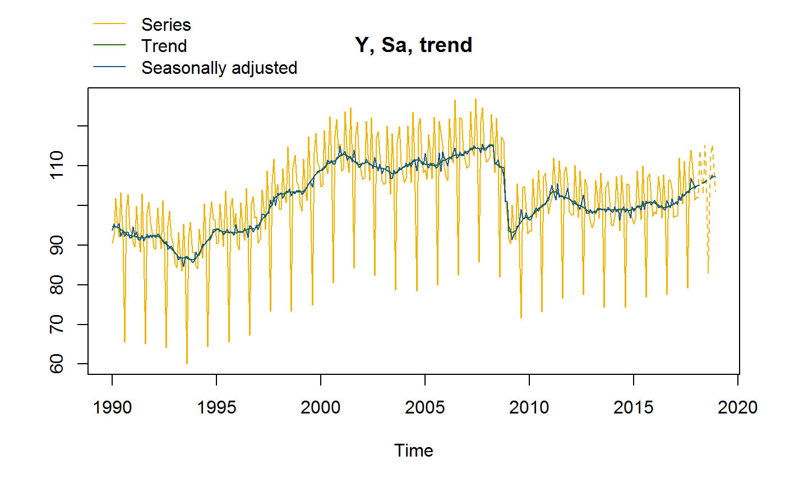
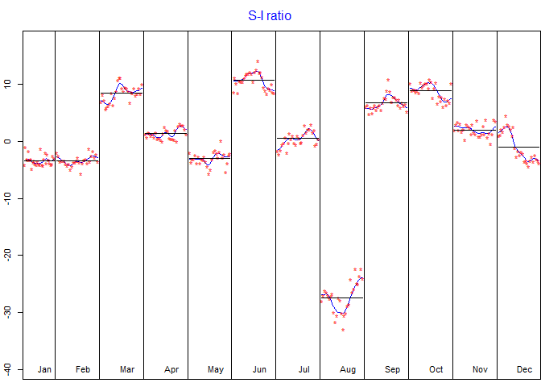

<!-- README.md is generated from README.Rmd. Please edit that file -->

# RJDemetra 

[](https://travis-ci.com/jdemetra/rjdemetra)
[](https://cran.r-project.org/package=rjdemetra)
[](https://cran.r-project.org/package=rjdemetra)
[](https://cran.r-project.org/package=rjdemetra)

RJDemetra is a R interface to JDemetra+, the seasonal adjustment
software [officially
recommended](https://ec.europa.eu/eurostat/cros/system/files/Jdemetra_%20release.pdf)
to the members of the European Statistical System (ESS) and the European
System of Central Banks. JDemetra+ implements the two leading seasonal
adjustment methods
[TRAMO/SEATS+](http://www.bde.es/bde/en/secciones/servicios/Profesionales/Programas_estadi/Programas_estad_d9fa7f3710fd821.html)
and [X-12ARIMA/X-13ARIMA-SEATS](https://www.census.gov/srd/www/x13as/).

Besides seasonal adjustment, JDemetra+ bundles other time series models
that are useful in the production or analysis of economic statistics,
including for instance outlier detection, nowcasting, temporal
disaggregation or benchmarking.

For more details on the JDemetra+ software see
<https://github.com/jdemetra/jdemetra-app>.

RJDemetra offers full access to all options and outputs of JDemetra+.

## Installation

RJDemetra relies on the
[rJava](https://CRAN.R-project.org/package=rJava) package and Java SE 8
or later version is required.

``` r
# Install release version from CRAN
install.packages("RJDemetra")

# Install development version from GitHub
# install.packages("devtools")
devtools::install_github("jdemetra/rjdemetra")
```

## Basic example

To seasonally adjust a time series with a pre-defined specification you
can either use the `x13_def()` function for the X-13ARIMA method or the
`tramoseats_def()` function for the TRAMO-SEATS method.

``` r
library(RJDemetra)
myseries <- ipi_c_eu[, "FR"]
x13_model <- x13_def(myseries) # X-13ARIMA method
ts_model <- tramoseats_def(myseries) # TRAMO-SEATS method

# Basic plot with the original series, the trend and the SA series
plot(x13_model, type_chart = "sa-trend")
```



``` r

# S-I ratio
plot(x13_model$decomposition)
```


